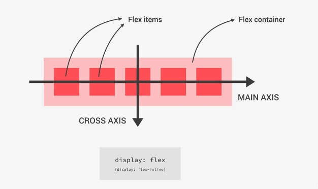
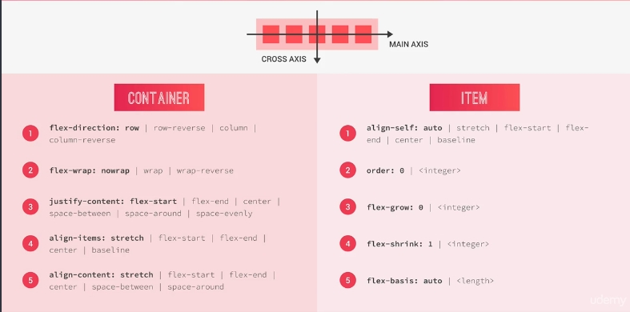

# Flexbox

<br />

## What is flexbox?

- it makes easy to align elements to one another, in different direction
- replaces float layouts, using less and more readable and logical code
- uses in one directional layouts

## Main flexbox concepts

<figure>
  
  <figcaption>Flexbox Structure</figcaption>
</figure>

<br /><br />

<figure>
  
  <figcaption>Flexbox Cheatsheet</figcaption>
</figure>

<br /><br />

```
flex-direction: row; // main-axis - horizontal, cross-axis - vertical
flex-direction: column; // main-axis - vertical, cross-axis - horizontal

justify-content - define main axis
align-content - define cross axis
```
